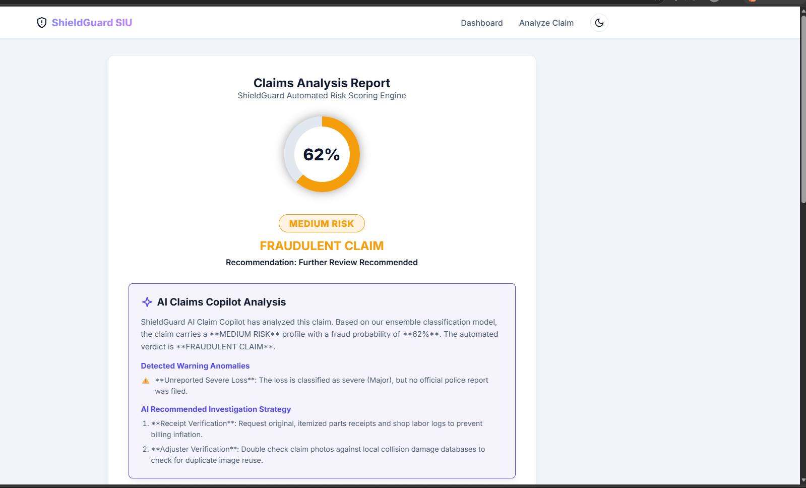
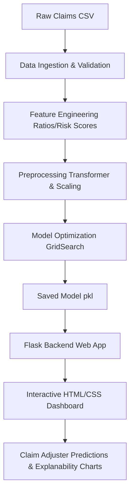

# ShieldGuard: P&C Insurance Claim Fraud Detection System

🛡️ **Automated Risk Scoring & Claim Analysis for Special Investigation Units (SIU)**

[](https://www.python.org/)
[](https://flask.palletsprojects.com/)
[](https://scikit-learn.org/)
[](https://xgboost.readthedocs.io/)
[](https://opensource.org/licenses/MIT)
[](https://dvc.org/)
[](https://www.docker.com/)
[](https://kubernetes.io/)
[](https://argoproj.github.io/argo-cd/)
[](https://prometheus.io/)
[](https://grafana.com/)
[](https://mlflow.org/)
[](https://www.kubeflow.org/)
[](https://github.com/features/actions)

## 🖥️ Application UI Preview



---

## 📋 Table of Contents
- [Project Overview](#project-overview)
- [Business Problem](#business-problem)
- [System Architecture](#system-architecture)
- [Dataset Features](#dataset-features)
- [Engineered Features](#engineered-features)
- [Machine Learning Performance](#machine-learning-performance)
- [Folder Structure](#folder-structure)
- [Setup & Run Instructions](#setup--run-instructions)
- [Dashboard & Visualizations](#dashboard--visualizations)
- [Risk Engine Rules](#risk-engine-rules)

---

## 🌟 Project Overview
ShieldGuard is an end-to-end Property & Casualty (P&C) Insurance Claim Fraud Detection Platform built using Machine Learning and Flask. The platform helps claim adjusters and Special Investigation Units (SIU) prioritize suspicious claims, minimize leakage, and flag potential fraud early in the claims lifecycle.

## 💼 Business Problem
P&C insurance carriers process thousands of claims daily. Fraudulent claims (staged accidents, exaggerated property damage, duplicate claims, lack of documentation) result in billions of dollars in losses. This platform provides an automated screening engine to assign high-recall fraud risk scores to incoming claims prior to settlement approvals.

### Target Variable
- `0` = Legitimate Claim
- `1` = Fraudulent Claim

---

## 🎯 Business Value & Problem Solving
ShieldGuard directly addresses the core challenges of insurance fraud detection by shifting from reactive investigation to proactive automated screening.

### 1. Mapping Fraud Patterns to Engineered Features
Rather than relying on manual rules, the system engineers advanced features targeting specific suspicious patterns:
* **Staged Accidents / Inflation**: Solved by `claim_to_insured_ratio` and `claim_to_premium_ratio`. If a claimant is claiming close to or above their maximum coverage limit immediately after policy activation, it is flagged.
* **Staged Collisions / Paper Accidents**: Solved by `incident_risk_score`. Claims involving major damage/total losses but lacking police reports or witnesses are heavily penalized.
* **Opportunistic Fraud**: Solved by `delay_risk_score`. Claims submitted with substantial delay or instantly (0 days delay) often signal coordination or fraud rings.
* **New Policy Exploitation**: Solved by `customer_risk_score`. Short policy lifetime (<90 days) paired with young driver demographics is a classic risk vector for premium fraud.

### 2. Operational Impact (SIU Triage Workflow)
By automating the risk categorization, the platform solves the bottleneck of manual reviews:
* **Automated STP (Straight-Through Processing)**: Claims classified as **LOW RISK** (0-40%) can bypass manual audits, reducing claim cycle time from weeks to hours and increasing customer satisfaction.
* **Targeted Investigations**: **HIGH RISK** claims (71-100%) are routed straight to Special Investigation Units (SIU) with visual feature importance charts, allowing investigators to focus resources where the probability of recovery is highest.

---

## ⚙️ System Architecture


---

## 📊 Dataset Features
| Feature Name | Type | Description |
|---|---|---|
| `policy_age_days` | Integer | Age of policy in days |
| `policy_type` | Categorical | Auto, Home, Commercial |
| `customer_age` | Integer | Age of customer |
| `claim_amount` | Numeric | Claimed loss amount |
| `insured_amount` | Numeric | Coverage limit amount |
| `premium_amount` | Numeric | Policy annual premium |
| `previous_claims` | Integer | Previous claims count |
| `claim_type` | Categorical | Collision, Theft, Fire |
| `incident_type` | Categorical | Collision, Theft, Fire, Water Damage |
| `incident_severity` | Categorical | Minor, Major, Total Loss |
| `witness_present` | Categorical | Yes / No |
| `police_report` | Categorical | Yes / No |
| `claim_submission_delay` | Integer | Days between incident and claim submission |
| `property_damage` | Categorical | Yes / No |
| `bodily_injuries` | Integer | Number of injuries |
| `vehicles_involved` | Integer | Number of vehicles |
| `state` | Categorical | State code (NY, CA, TX, FL, IL) |
| `claim_month` | Categorical | Month of claim |

---

## 🛠️ Engineered Features
To capture fraudulent signals, the feature engineering pipeline generates the following custom features:
- `claim_to_insured_ratio`: Ratio of claimed amount to coverage amount.
- `claim_to_premium_ratio`: Ratio of claimed amount to annual premium.
- `previous_claim_frequency`: Number of previous claims normalized by policy age in years.
- `delay_risk_score`: High delay (> 15 days) or immediate submission (0 days) flags.
- `customer_risk_score`: Combines young age (< 25) and short policy lifetimes (< 90 days).
- `incident_risk_score`: Flags severe claims without police reports/witnesses.

---

## 🏆 Machine Learning Performance
During pipeline execution, multiple models are evaluated using hyperparameter tuning. The best-performing model is selected automatically by prioritizing **Recall** and **ROC-AUC**:

| Model Name | Test Accuracy | Test Precision | Test Recall | Test ROC-AUC |
|---|---|---|---|---|
| **Random Forest** *(Selected)* | **74.17%** | **73.24%** | **54.74%** | **73.44%** |
| XGBoost | 70.83% | 67.12% | 51.58% | 73.85% |
| LightGBM | 71.25% | 68.06% | 51.58% | 74.29% |
| Logistic Regression | 70.83% | 68.66% | 48.42% | 72.63% |
| Decision Tree | 69.58% | 62.22% | 58.95% | 66.88% |

---

## 📂 Folder Structure
```text
pnc-claim-fraud-detection-ml/
├── data/
│   ├── raw/
│   │   └── insurance_claims_raw.csv
│   └── processed/
│       ├── train.csv
│       └── test.csv
├── notebooks/
│   └── eda.ipynb              # Exploratory Data Analysis Notebook
├── src/
│   ├── data_ingestion.py      # Cleaning and train/test splits
│   ├── preprocessing.py       # Pipelines and ColumnTransformers
│   ├── feature_engineering.py # Custom ratio and risk score indicators
│   ├── train.py               # Model tuning and best selection
│   ├── evaluate.py            # Diagnostic plot generators
│   └── predict.py             # Claim prediction module
├── models/
│   └── fraud_model.pkl        # Serialized preprocessor & classifier
├── templates/
│   ├── index.html             # Dashboards and EDA views
│   ├── predict.html           # Claims form
│   └── result.html            # Prediction result & gauge
├── static/
│   ├── css/
│   │   └── style.css          # Premium glassmorphic stylesheet
│   └── images/                # Matplotlib visualization plots
├── app.py                     # Flask web server
├── generate_data.py           # Synthetic data generation engine
├── requirements.txt           # Package dependencies
└── README.md                  # System documentation
```

---

## 🚀 Setup & Run Instructions

### 1. Install Dependencies
Ensure you have Python 3.8+ installed. Install the requirements:
```bash
pip install -r requirements.txt
```

### 2. Generate Synthetic Data
Generate a fresh `insurance_claims.csv` dataset:
```bash
python generate_data.py
```

### 3. Run Pipeline (Train and Evaluate Models)
```bash
python src/train.py
python src/evaluate.py
```

### 4. Run the Web Application
```bash
python app.py
```
Open your browser and navigate to: `http://127.0.0.1:5000`

---

## 📈 Dashboard & Visualizations
The ShieldGuard dashboard displays comprehensive data analytics generated automatically:
- **Fraud vs Legitimate Count**
- **Claim Amount Distributions**
- **Incident Severity Analysis**
- **Outlier Boxplots**
- **Correlation Heatmap**
- **Feature Importance Explanation** (Integrated directly into the results page)

---

## 🚦 Risk Engine Rules
The system calculates a continuous probability of fraud ($0.0 \rightarrow 1.0$) and maps it to risk categories:
- **0 - 40%** $\rightarrow$ **LOW RISK**: Approve claim (Standard processing).
- **41 - 70%** $\rightarrow$ **MEDIUM RISK**: Further review recommended.
- **71 - 100%** $\rightarrow$ **HIGH RISK**: Manual investigation required (Route directly to SIU).

---

## 🛠️ MLOps Tooling & Command Reference

### 1. DVC (Data Version Control)
Used to version control models and datasets, offloading heavy binaries to AWS S3.
* **Initialize DVC**:
  ```bash
  dvc init
  ```
* **Configure AWS S3 Remote**:
  ```bash
  dvc remote add -d myremote s3://insurance-claims-bucket/models
  ```
* **Track a Model**:
  ```bash
  dvc add models/fraud_model.pkl
  ```
* **Push/Pull Models**:
  ```bash
  dvc push
  dvc pull
  ```

### 2. Docker Containerization
Used to package the Python backend, UI templates, and estimators into an isolated, lightweight container image.
* **Build Image**:
  ```bash
  docker build -t pnc-fraud-app .
  ```
* **Run Container**:
  ```bash
  docker run -d -p 8000:8000 --name pnc-app-instance pnc-fraud-app
  ```

### 3. Kubernetes, KIND & KServe Deployments
Used to orchestrate containerized serving workloads and host the KServe InferenceService.
* **Create KIND Local Cluster**:
  ```bash
  kind create cluster --name pnc-claims-cluster
  ```
* **Verify Cluster**:
  ```bash
  kubectl cluster-info
  ```
* **Install KServe CRDs**:
  ```bash
  kubectl apply -f https://github.com/kserve/kserve/releases/download/v0.11.0/kserve.yaml
  ```
* **Deploy Model Inference Endpoint**:
  ```bash
  kubectl apply -f k8s/namespace.yaml
  kubectl apply -f k8s/serviceaccount.yaml
  kubectl apply -f k8s/inference.yaml
  ```
* **Check Serving Pods & CRD Status**:
  ```bash
  kubectl get inferenceservice -n pc-claims
  ```

### 4. ArgoCD GitOps Sync
Allows GitOps synchronization. Push config changes to GitHub, and ArgoCD automatically deploys the updated `inference.yaml` to KIND.
* **Install ArgoCD**:
  ```bash
  kubectl create namespace argocd
  kubectl apply -n argocd -f https://raw.githubusercontent.com/argoproj/argo-cd/stable/manifests/install.yaml
  ```
* **Deploy Application Sync definition**:
  ```bash
  kubectl apply -f argocd/application.yaml
  ```

### 5. Prometheus & Grafana Monitoring Setup
Tracks transaction volumes, error rates, latencies, and fraud ratios.
* **Start Prometheus**:
  ```bash
  prometheus --config.file=monitoring/prometheus/prometheus.yml
  ```
* **Expose Metrics Endpoint**:
  Accessible in browser or via scraping at: `http://localhost:8000/metrics`

### 6. MLflow Experiment Tracking
Used to record parameters, model objects, and metric curves during pipelines.
* **Launch MLflow local server**:
  ```bash
  mlflow server --host 127.0.0.1 --port 5000
  ```
* **Register/Log parameters & metrics**: Automatically logged to local SQLite db (`./mlruns`) when executing `python train.py`.

### 7. Kubeflow Pipelines (KFP)
Used to orchestrate pipeline stages in a cloud-native environment.
* **Compile Python DSL into KFP Manifest**:
  ```bash
  python src/pipeline/kubeflow_pipeline.py
  ```
  Generates `claims_pipeline.yaml` that can be imported directly into the Kubeflow Pipelines Dashboard.

